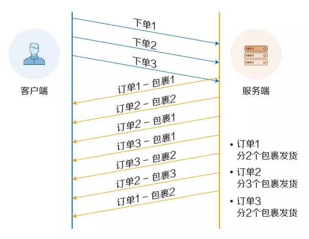
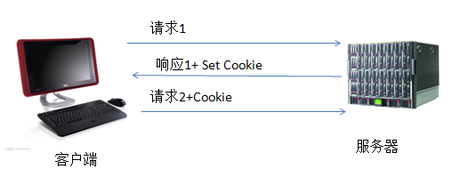
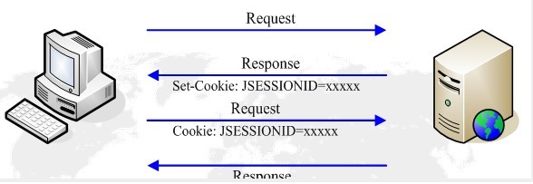

# HTTP

## HTTP介绍

HTTP是Hyper Text Transfer Protocol（超文本传输协议）的缩写，用于从WWW服务器传输超文本到本地浏览器的传送协议。它可以使浏览器更加高效，使网络传输减少。

 HTTP默认的端口号为80，HTTPS的端口号为443。

HTTP  （ TLS, SSL\) 

TCP

IP

数据连接层

## HTTP特点

 HTTP协议永远都是客户端发起请求，服务器回送响应。这样就限制了使用HTTP协议，

* 支持客户/服务器模式。支持基本认证和安全认证。
* 简单快速：客户向服务器请求服务时，只需传送请求方法和路径
* 请求方法常用的有GET、HEAD、POST。每种方法规定了客户与服务器联系的类型不同。由于HTTP协议简单，使得HTTP服务器的程序规模小，因而通信速度很快。
* 灵活：HTTP允许传输任意类型的数据对象。正在传输的类型由Content-Type加以标记。 
* 无状态：HTTP协议是无状态协议。无状态是指协议对于事务处理没有记忆能力。缺少状态意味着如果后续处理需要前面的信息，则它必须重传，这样可能导致每次连接传送的数据量增大

## HTTP是无状态协议

无状态是指协议对于事务处理没有记忆能力，服务器不知道客户端是什么状态。从另一方面讲，打开一个服务器上的网页和你之前打开这个服务器上的网页之间没有任何联系。

HTTP是一个无状态的面向连接的协议，无状态不代表HTTP不能保持TCP连接，更不能代表HTTP使用的是UDP协议（无连接）。

从HTTP/1.1起，默认都开启了**Keep-Alive**，保持连接特性，简单地说，当一个网页打开完成后，客户端和服务器之间用于传输HTTP数据的TCP连接不会关闭，如果客户端再次访问这个服务器上的网页，会继续使用这一条已经建立的连接。

Keep-Alive不会永久保持连接，它有一个保持时间，可以在不同的服务器软件（如Apache）中设定这个时间。  

## 工作流程

1. 首先客户机与服务器需要建立连接。只要单击某个超级链接，HTTP的工作开始。
2. 建立连接后，客户机发送一个请求给服务器，请求方式的格式为：统一资源标识符（URL）、协议版本号，后边是MIME信息包括请求修饰符、客户机信息和可能的内容。
3. 服务器接到请求后，给予相应的响应信息，其格式为一个状态行，包括信息的协议版本号、一个成功或错误的代码，后边是MIME信息包括服务器信息、实体信息和可能的内容。
4. 客户端接收服务器所返回的信息通过浏览器显示在用户的显示屏上，然后客户机与服务器断开连接。 

## **个页面从输入 URL 到页面加载显示，这个过程中都发生了什么？**

1. 浏览器会开启一个线程来处理这个请求，对 URL 分析判断如果是 http 协议就按照 Web 方式来处理; 
2. 调用浏览器内核中的对应方法，比如 WebView 中的 loadUrl 方法; 
3. 通过DNS\(域名系统\)解析获取网址的IP地址，
4. 浏览器会先搜索本地的 浏览器DNS缓存 -&gt; 本地缓存-&gt; 路由器DNS缓存-&gt; ISP DNS缓存-&gt; 根域名服务器查找
5. 进行HTTP协议会话，客户端发送报头\(请求报头\); 
6. 进入到web服务器上的 Web Server，如 Apache、Tomcat、Node.JS 等服务器; 
7. 进入部署好的后端应用，如 PHP、Java、JavaScript、Python 等，找到对应的请求处理; 
8. 处理结束回馈报头，此处如果浏览器访问过，缓存上有对应资源，会与服务器最后修改时间对比，一致则返回304; 
9. 浏览器开始下载html文档\(响应报头，状态码200\)，同时使用缓存; 
10. 文档树建立，根据标记请求所需指定MIME类型的文件（比如css、js）,同时设置了cookie; 
11. 页面开始渲染DOM，JS根据DOM API操作DOM,执行事件绑定等，页面显示完成。

简洁版： 浏览器根据请求的URL交给DNS域名解析，找到真实IP，向服务器发起请求； 服务器交给后台处理完成后返回数据，浏览器接收文件（HTML、JS、CSS、图象等）； 浏览器对加载到的资源（HTML、JS、CSS等）进行语法解析，建立相应的内部数据结构（如HTML的DOM）； 载入解析到的资源文件，渲染页面，完成。

**什么是DNS劫持？**

是指一些刻意制造或无意中制造出来的域名服务器数据包，把域名指往不正确的IP地址

## HTTP与TCP的关系

HTTP是基于传输层的TCP协议，而TCP是一个端到端的面向连接的协议。所谓的端到端可以理解为进程到进程之间的通信。所以HTTP在开始传输之前，首先需要建立TCP连接，而TCP连接的过程需要所谓的“三次握手”。下图所示TCP连接的三次握手。

在TCP三次握手之后，建立了TCP连接，此时HTTP就可以进行传输了。一个重要的概念是面向连接，既HTTP在传输完成之间并不断开TCP连接。在HTTP1.1中\(通过Connection头设置\)这是默认行为。

## HTTP版本之间的区别\(HTTP/2\)

* HTTP1.0默认是短连接：
* HTTP1.1默认是**持久化连接\(** **建立一次连接，多次请求均由这个连接完成\)**！ 
* HTTP/2 连接发起多重的请求-响应消息

把原来HTTP1.x的header和body部分用frame重新封装了一层而已

* **二进制分帧**: HTTP/2 采用二进制格式传输数据，而非 HTTP/1.x 的文本格式。 **HTTP/2 中，同域名下所有通信都在单个连接上完成，该连接可以承载任意数量的双向数据流。**每个数据流都以消息的形式发送，而消息又由一个或多个帧组成。多个帧之间可以乱序发送，根据帧首部的流标识可以重新组装。 
* **多路复用**允许同时通过单一的 HTTP/2 连接发起多重的请求-响应消息，合并多个请求为一个的优化将不再适用。
* 头部压缩
* 服务器推送

## 加密技术

3y的通讯之路：

* 远古时代：3y和女朋友聊天传输数据之间没有任何的加密，直接传输
  * 内容被看得一清二楚，毫无隐私可言
* 上古时期：使用对称加密的方式来保证传输的数据只有两个人知道
  * 此时有个问题：**密钥不能通过网络传输**\(因为没有加密之前，都是不安全的\)，所以3y和女朋友先约见面一次，告诉对方密码是多少，再对话聊天。
* 中古时期：3y不单单要跟女朋友聊天，还要跟爸妈聊天的哇\(同样不想泄漏了自己的通讯信息\)。那有那么多人，难道每一次都要约来见面一次吗？\(说明维护多个对称密钥是麻烦的！\)---&gt;所以用到了非对称加密
  * 3y自己保留一份密码，独一无二的\(私钥\)。告诉3y女朋友，爸妈一份密码\(这份密码是公开的，谁都可以拿---&gt;公钥\)。让他们给我发消息之前，先用那份我告诉他们的密码加密一下，再发送给我。我收到信息之后，用自己独一无二的私钥解密就可以了！
* 近代：此时又出现一个问题：虽然别人不知道私钥是什么，拿不到你**原始传输**的数据，但是可以拿到加密后的数据，他们可以**改掉**某部分的数据再发送给服务器，这样服务器拿到的数据就**不是完整的**了。
  * 3y女朋友给3y发了一条信息”3y我喜欢你“，然后用3y给的公钥加密，发给3y了。此时不怀好意的人截取到这条加密的信息，他**破解不了原信息**。但是他可以**修改加密后的数据**再传给3y。可能3y拿到收到的数据就是”3y你今晚跪键盘吧“
* 现代：拿到的数据可能被篡改了，我们可以使用数字签名来解决被篡改的问题。数字签名其实也可以看做是**非对称加密的手段一种**，具体是这样的：得到原信息hash值，用**私钥**对hash值加密，**另一端**用**公钥**解密，最后比对hash值是否变了。如果变了就说明被篡改了。\(一端用私钥加密，另一端用公钥解密，也确保了来源\)
* 目前现在：好像使用了数字签名就万无一失了，其实还有问题。我们使用非对称加密的时候，是使用**公钥进行加密的**。如果**公钥被伪造了**，后面的数字签名其实就毫无意义了。讲到底：**还是可能会被中间人攻击**~此时我们就有了**CA认证机构来确认公钥的真实性**！

## 请求方法

* OPTIONS- 返回服务器针对特定资源所支持的HTTP请求方法。也可以利用向Web服务器发送'\*'的请求来测试服务器的功能性。
* HEAD- 向服务器索要与GET请求相一致的响应，只不过响应体将不会被返回。这一方法可以在不必传输整个响应内容的情况下，就可以获取包含在响应消息头中的元信息。该方法常用于测试超链接的有效性，是否可以访问，以及最近是否更新。
* GET- 向特定的资源发出请求。注意：GET方法不应当被用于产生“副作用”的操作中，例如在web app.中。其中一个原因是GET可能会被网络蜘蛛等随意访问。
* POST- 向指定资源提交数据进行处理请求（例如提交表单或者上传文件）。数据被包含在请求体中。POST请求可能会导致新的资源的建立和/或已有资源的修改。
* PUT- 向指定资源位置上传其最新内容。
* DELETE- 请求服务器删除Request-URI所标识的资源。
* TRACE- 回显服务器收到的请求，主要用于测试或诊断。
* CONNECT- HTTP/1.1协议中预留给能够将连接改为管道方式的代理服务器。
* PATCH- 用来将局部修改应用于某一资源，添加于规范RFC5789。 

## GET and POST 区别

1. GET提交的数据会放在URL之后，以?分割URL和传输数据，参数之间以&相连，如EditPosts.aspx?name=test1&id=123456. POST方法是把提交的数据放在HTTP包的Body中。
2. GET提交的数据大小有限制，最多只能有1024字节（因为浏览器对URL的长度有限制），而POST方法提交的数据没有限制。
3. GET方式需要使用Request.QueryString来取得变量的值，而POST方式通过Request.Form来获取变量的值。
4. GET方式提交数据，会带来安全问题，比如一个登录页面，通过GET方式提交数据时，用户名和密码将出现在URL上，如果页面可以被缓存或者其他人可以访问这台机器，就可以从历史记录获得该用户的账号和密码。 

## 响应消息 response 

 三个部分分别是：状态行、消息报头、响应正文。

If-Modified-Since：把浏览器端缓存页面的最后修改时间发送到服务器去，服务器会把这个时间与服务器上实际文件的最后修改时间进行对比。如果时间一致，那么返回304，客户端就直接使用本地缓存文件。如果时间不一致，就会返回200和新的文件内容。客户端接到之后，会丢弃旧文件，把新文件缓存起来，并显示在浏览器中。  

If-None-Match：If-None-Match和ETag一起工作，工作原理是在HTTP Response中添加ETag信息。 当用户再次请求该资源时，将在HTTP Request 中加入If-None-Match信息\(ETag的值\)。如果服务器验证资源的ETag没有改变（该资源没有更新），将返回一个304状态告诉客户端使用本地缓存文件。否则将返回200状态和新的资源和Etag.  使用这样的机制将提高网站的性能。例如: If-None-Match: "03f2b33c0bfcc1:0"。  

Cache-Control：指定请求和响应遵循的缓存机制。缓存指令是单向的（响应中出现的缓存指令在请求中未必会出现），且是独立的（在请求消息或响应消息中设置Cache-Control并不会修改另一个消息处理过程中的缓存处理过程）。请求时的缓存指令包括no-cache、no-store、max-age、max-stale、min-fresh、only-if-cached，响应消息中的指令包括public、private、no-cache、no-store、no-transform、must-revalidate、proxy-revalidate、max-age、s-maxage。

Cache-Control:Public 可以被任何缓存所缓存

Cache-Control:Private 内容只缓存到私有缓存中

Cache-Control:no-cache 所有内容都不会被缓存

Cache-Control:no-store 用于防止重要的信息被无意的发布。在请求消息中发送将使得请求和响应消息都不使用缓存。

Cache-Control:max-age 指示客户机可以接收生存期不大于指定时间（以秒为单位）的响应。

Cache-Control:min-fresh 指示客户机可以接收响应时间小于当前时间加上指定时间的响应。

Cache-Control:max-stale 指示客户机可以接收超出超时期间的响应消息。如果指定max-stale消息的值，那么客户机可以接收超出超时期指定值之内的响应消息。

Accept：浏览器端可以接受的MIME类型。例如：Accept: text/html 代表浏览器可以接受服务器回发的类型为 text/html 也就是我们常说的html文档，如果服务器无法返回text/html类型的数据，服务器应该返回一个406错误\(non acceptable\)。通配符 \* 代表任意类型，例如 Accept: \*/\* 代表浏览器可以处理所有类型，\(一般浏览器发给服务器都是发这个\)。

Accept-Encoding：浏览器申明自己可接收的编码方法，通常指定压缩方法，是否支持压缩，支持什么压缩方法（gzip，deflate）;Servlet能够向支持gzip的浏览器返回经gzip编码的HTML页面。许多情形下这可以减少5到10倍的下载时间。例如： Accept-Encoding: gzip, deflate。如果请求消息中没有设置这个域，服务器假定客户端对各种内容编码都可以接受。

Accept-Language：浏览器申明自己接收的语言。语言跟字符集的区别：中文是语言，中文有多种字符集，比如big5，gb2312，gbk等等；例如：Accept-Language: en-us。如果请求消息中没有设置这个报头域，服务器假定客户端对各种语言都可以接受。

Accept-Charset：浏览器可接受的字符集。如果在请求消息中没有设置这个域，缺省表示任何字符集都可以接受。

User-Agent：告诉HTTP服务器，客户端使用的操作系统和浏览器的名称和版本。

例如：

User-Agent: Mozilla/4.0 \(compatible; MSIE 8.0; Windows NT 5.1;

Trident/4.0; CIBA; .NET CLR 2.0.50727; .NET CLR 3.0.4506.2152; .NET CLR

3.5.30729; .NET4.0C; InfoPath.2; .NET4.0E\)。

Content-Type：例如：Content-Type: application/x-www-form-urlencoded。

Referer：包含一个URL，用户从该URL代表的页面出发访问当前请求的页面。提供了Request的上下文信息的服务器，告诉服务器我是从哪个链接过来的，比如从我主页上链接到一个朋友那里，他的服务器就能够从HTTP Referer中统计出每天有多少用户点击我主页上的链接访问他的网站。

例如: Referer:http://translate.google.cn/?hl=zh-cn&tab=wT

Connection：

例如：Connection:

keep-alive

当一个网页打开完成后，客户端和服务器之间用于传输HTTP数据的TCP连接不会关闭，如果客户端再次访问这个服务器上的网页，会继续使用这一条已经建立的连接。HTTP

1.1默认进行持久连接。利用持久连接的优点，当页面包含多个元素时（例如Applet，图片），显著地减少下载所需要的时间。要实现这一点，Servlet需要在应答中发送一个Content-Length头，最简单的实现方法是：先把内容写入ByteArrayOutputStream，然后在正式写出内容之前计算它的大小。

Connection: close 代表一个Request完成后，客户端和服务器之间用于传输HTTP数据的TCP连接会关闭，当客户端再次发送Request，需要重新建立TCP连接。

Host：（发送请求时，该头域是必需的）主要用于指定被请求资源的Internet主机和端口号，它通常从HTTP URL中提取出来的。HTTP/1.1请求必须包含主机头域，否则系统会以400状态码返回。

例如:

我们在浏览器中输入：http://www.guet.edu.cn/index.html，浏览器发送的请求消息中，就会包含Host请求头域：Host：http://www.guet.edu.cn，此处使用缺省端口号80，若指定了端口号，则变成：Host：指定端口号。

Cookie：最重要的请求头之一, 将cookie的值发送给HTTP服务器。

Content-Length：表示请求消息正文的长度。例如：Content-Length: 38。

Authorization：授权信息，通常出现在对服务器发送的WWW-Authenticate头的应答中。主要用于证明客户端有权查看某个资源。当浏览器访问一个页面时，如果收到服务器的响应代码为401（未授权），可以发送一个包含Authorization请求报头域的请求，要求服务器对其进行验证。

UA-Pixels，UA-Color，UA-OS，UA-CPU：由某些版本的IE浏览器所发送的非标准的请求头，表示屏幕大小、颜色深度、操作系统和CPU类型。

From：请求发送者的email地址，由一些特殊的Web客户程序使用，浏览器不会用到它。

Range：可以请求实体的一个或者多个子范围。例如，

表示头500个字节：bytes=0-499

表示第二个500字节：bytes=500-999

表示最后500个字节：bytes=-500

表示500字节以后的范围：bytes=500-

第一个和最后一个字节：bytes=0-0,-1

同时指定几个范围：bytes=500-600,601-999

但是服务器可以忽略此请求头，如果无条件GET包含Range请求头，响应会以状态码206（PartialContent）返回而不是以200（OK）。

**6.6、HTTP常见的响应头**

Allow：服务器支持哪些请求方法（如GET、POST等）。

Date：表示消息发送的时间，时间的描述格式由rfc822定义。例如，Date:Mon,31Dec200104:25:57GMT。Date描述的时间表示世界标准时，换算成本地时间，需要知道用户所在的时区。你可以用setDateHeader来设置这个头以避免转换时间格式的麻烦

Expires：指明应该在什么时候认为文档已经过期，从而不再缓存它，重新从服务器获取，会更新缓存。过期之前使用本地缓存。HTTP1.1的客户端和缓存会将非法的日期格式（包括0）看作已经过期。eg：为了让浏览器不要缓存页面，我们也可以将Expires实体报头域，设置为0。

例如: Expires: Tue, 08 Feb 2022 11:35:14 GMT

P3P：用于跨域设置Cookie, 这样可以解决iframe跨域访问cookie的问题

例如: P3P: CP=CURa ADMa DEVa PSAo PSDo OUR BUS UNI PUR INT DEM STA PRE COM NAV OTC NOI DSP COR

Set-Cookie：非常重要的header, 用于把cookie发送到客户端浏览器，每一个写入cookie都会生成一个Set-Cookie。

例如: Set-Cookie: sc=4c31523a; path=/; domain=.acookie.taobao.com

ETag：和If-None-Match 配合使用。

Last-Modified：用于指示资源的最后修改日期和时间。Last-Modified也可用setDateHeader方法来设置。

Content-Type：WEB服务器告诉浏览器自己响应的对象的类型和字符集。Servlet默认为text/plain，但通常需要显式地指定为text/html。由于经常要设置Content-Type，因此HttpServletResponse提供了一个专用的方法setContentType。可在web.xml文件中配置扩展名和MIME类型的对应关系。

例如:Content-Type: text/html;charset=utf-8

Content-Type:text/html;charset=GB2312

Content-Type: image/jpeg

媒体类型的格式为：大类/小类，比如text/html。

IANA\(The Internet Assigned Numbers Authority，互联网数字分配机构\)定义了8个大类的媒体类型，分别是:

application— \(比如: application/vnd.ms-excel.\)

audio \(比如: audio/mpeg.\)

image \(比如: image/png.\)

message \(比如,:message/http.\)

model\(比如:model/vrml.\)

multipart \(比如:multipart/form-data.\)

text\(比如:text/html.\)

video\(比如:video/quicktime.\)

Content-Range：用于指定整个实体中的一部分的插入位置，他也指示了整个实体的长度。在服务器向客户返回一个部分响应，它必须描述响应覆盖的范围和整个实体长度。一般格式：Content-Range:bytes-unitSPfirst-byte-pos-last-byte-pos/entity-length。

例如，传送头500个字节次字段的形式：Content-Range:bytes0-499/1234如果一个http消息包含此节（例如，对范围请求的响 应或对一系列范围的重叠请求），Content-Range表示传送的范围。

Content-Length：指明实体正文的长度，以字节方式存储的十进制数字来表示。在数据下行的过程中，Content-Length的方式要预先在服务器中缓存所有数据，然后所有数据再一股脑儿地发给客户端。只有当浏览器使用持久HTTP连接时才需要这个数据。如果你想要利用持久连接的优势，可以把输出文档写入ByteArrayOutputStram，完成后查看其大小，然后把该值放入Content-Length头，最后通过byteArrayStream.writeTo\(response.getOutputStream\(\)发送内容。

例如: Content-Length: 19847

Content-Encoding：WEB服务器表明自己使用了什么压缩方法（gzip，deflate）压缩响应中的对象。只有在解码之后才可以得到Content-Type头指定的内容类型。利用gzip压缩文档能够显著地减少HTML文档的下载时间。Java的GZIPOutputStream可以很方便地进行gzip压缩，但只有Unix上的Netscape和Windows上的IE 4、IE 5才支持它。因此，Servlet应该通过查看Accept-Encoding头（即request.getHeader\("Accept-Encoding"\)）检查浏览器是否支持gzip，为支持gzip的浏览器返回经gzip压缩的HTML页面，为其他浏览器返回普通页面。

例如：Content-Encoding：gzip

Content-Language：WEB服务器告诉浏览器自己响应的对象所用的自然语言。例如： Content-Language:da。没有设置该域则认为实体内容将提供给所有的语言阅读。

Server：指明HTTP服务器用来处理请求的软件信息。例如：Server: Microsoft-IIS/7.5、Server：Apache-Coyote/1.1。此域能包含多个产品标识和注释，产品标识一般按照重要性排序。

X-AspNet-Version：如果网站是用ASP.NET开发的，这个header用来表示ASP.NET的版本。

例如: X-AspNet-Version: 4.0.30319

X-Powered-By：表示网站是用什么技术开发的。

例如： X-Powered-By: ASP.NET

Connection：

例如：Connection: keep-alive  当一个网页打开完成后，客户端和服务器之间用于传输HTTP数据的TCP连接不会关闭，如果客户端再次访问这个服务器上的网页，会继续使用这一条已经建立的连接。

Connection: close 代表一个Request完成后，客户端和服务器之间用于传输HTTP数据的TCP连接会关闭，当客户端再次发送Request，需要重新建立TCP连接。

Location：用于重定向一个新的位置，包含新的URL地址。表示客户应当到哪里去提取文档。Location通常不是直接设置的，而是通过HttpServletResponse的sendRedirect方法，该方法同时设置状态代码为302。Location响应报头域常用在更换域名的时候。

Refresh：表示浏览器应该在多少时间之后刷新文档，以秒计。除了刷新当前文档之外，你还可以通过setHeader\("Refresh", "5; URL=http://host/path"\)让浏览器读取指定的页面。注意这种功能通常是通过设置HTML页面HEAD区的实现，这是因为，自动刷新或重定向对于那些不能使用CGI或Servlet的HTML编写者十分重要。但是，对于Servlet来说，直接设置Refresh头更加方便。注意Refresh的意义是“N秒之后刷新本页面或访问指定页面”，而不是“每隔N秒刷新本页面或访问指定页面”。因此，连续刷新要求每次都发送一个Refresh头，而发送204状态代码则可以阻止浏览器继续刷新，不管是使用Refresh头还是。注意Refresh头不属于HTTP 1.1正式规范的一部分，而是一个扩展，但Netscape和IE都支持它。

WWW-Authenticate：该响应报头域必须被包含在401（未授权的）响应消息中，客户端收到401响应消息时候，并发送Authorization报头域请求服务器对其进行验证时，服务端响应报头就包含该报头域。

eg：WWW-Authenticate:Basic realm="Basic Auth Test!"  //可以看出服务器对请求资源采用的是基本验证机制。  

## **HTTP状态码**

* 100 Continue 继续，一般在发送post请求时，已发送了http header之后服务端将返回此信息，表示确认，之后发送具体参数信息 
* 200 OK 正常返回信息
* 201 Created 请求成功并且服务器创建了新的资源 
* 202 Accepted 服务器已接受请求，但尚未处理
* 301 Moved Permanently 请求的网页已永久移动到新位置。 
* 302 Found 临时性重定向。 
* 303 See Other 临时性重定向，且总是使用 GET 请求新的 URI。 
* 304 Not Modified 自从上次请求后，请求的网页未修改过。
* 400 Bad Request 服务器无法理解请求的格式，客户端不应当尝试再次使用相同的内容发起请求
* 401 Unauthorized 请求未授权。
* 403 Forbidden 禁止访问。 
* 404 Not Found 找不到如何与 URI 相匹配的资源。
* 500 Internal Server Error 最常见的服务器端错误。 
* 503 Service Unavailable 服务器端暂时无法处理请求（可能是过载或维护）。 \]

## 解决HTTP无状态的问题

1. 通过Cookies保存状态信息

 通过Cookies，服务器就可以清楚的知道请求2和请求1来自同一个客户端。

  坦白的说，一个cookie就是存储在用户主机浏览器中的一小段文本文件。Cookies是纯文本形式，它们不包含任何可执行代码。一个Web页面或服务器告之浏览器来将这些信息存储并且基于一系列规则在之后的每个请求中都将该信息返回至服务器。Web服务器之后可以利用这些信息来标识用户。多数需要登录的站点通常会在你的认证信息通过后来设置一个cookie，之后只要这个cookie存在并且合法，你就可以自由的浏览这个站点的所有部分。再次，cookie只是包含了数据，就其本身而言并不有害。

创建cookie

       通过HTTP的Set-Cookie消息头，Web服务器可以指定存储一个cookie。Set-Cookie消息的格式如下面的字符串（中括号中的部分都是可选的）

 在没有expires选项时，cookie的寿命仅限于单一的会话中。浏览器的关闭意味这一次会话的结束，所以会话cookie只存在于浏览器保持打开的状态之下。这就是为什么当你登录到一个web应用时经常看到一个checkbox，询问你是否选择存储你的登录信息：如果你选择是的话，那么一个expires选项会被附加到登录的cookie中。如果expires选项设置了一个过去的时间点，那么这个cookie会被立即删除。

|  `Set-Cookie:value [ ;expires=date][ ;domain=domain][ ;path=path][ ;secure]` |
| :--- |

1. 通过session保存状态信息

 在没有expires选项时，cookie的寿命仅限于单一的会话中。浏览器的关闭意味这一次会话的结束，所以会话cookie只存在于浏览器保持打开的状态之下。这就是为什么当你登录到一个web应用时经常看到一个checkbox，询问你是否选择存储你的登录信息：如果你选择是的话，那么一个expires选项会被附加到登录的cookie中。如果expires选项设置了一个过去的时间点，那么这个cookie会被立即删除。

**Cookie和Session有以下明显的不同点：**

1）Cookie将状态保存在客户端，Session将状态保存在服务器端；

2）Cookies是服务器在本地机器上存储的小段文本并随每一个请求发送至同一个服务器。Cookie最早在RFC2109中实现，后续RFC2965做了增强。网络服务器用HTTP头向客户端发送cookies，在客户终端，浏览器解析这些cookies并将它们保存为一个本地文件，它会自动将同一服务器的任何请求缚上这些cookies。Session并没有在HTTP的协议中定义；

3）Session是针对每一个用户的，变量的值保存在服务器上，用一个sessionID来区分是哪个用户session变量,这个值是通过用户的浏览器在访问的时候返回给服务器，当客户禁用cookie时，这个值也可能设置为由get来返回给服务器；

4）就安全性来说：当你访问一个使用session 的站点，同时在自己机子上建立一个cookie，建议在服务器端的SESSION机制更安全些。因为它不会任意读取客户存储的信息。

## **URL详解**

URL\(Uniform Resource Locator\) 地址用于描述一个网络上的资源， 基本**格式**如下

schema://host\[:port\#\]/path/.../\[;url-params\]\[?query-string\]\[\#anchor\]

scheme          指定低层使用的协议\(例如：http, https, ftp\)

host            HTTP服务器的IP地址或者域名

port\#          HTTP服务器的默认端口是80，这种情况下端口号可以省略。如果使用了别的端口，必须指明，例如 http://www.cnblogs.com:8080/

path            访问资源的路径

url-params

query-string    发送给http服务器的数据

anchor-        锚

## **缓存的实现原理**

WEB缓存\(cache\)位于Web服务器和客户端之间。

缓存会根据请求保存输出内容的副本，例如html页面，图片，文件，当下一个请求来到的时候：如果是相同的URL，缓存直接使用副本响应访问请求，而不是向源服务器再次发送请求。

HTTP协议定义了相关的消息头来使WEB缓存尽可能好的工作。

10.1、缓存的优点

减少相应延迟：因为请求从缓存服务器（离客户端更近）而不是源服务器被相应，这个过程耗时更少，让web服务器看上去相应更快。

减少网络带宽消耗：当副本被重用时会减低客户端的带宽消耗；客户可以节省带宽费用，控制带宽的需求的增长并更易于管理。

10.2、客户端缓存生效的常见流程

服务器收到请求时，会在200OK中回送该资源的Last-Modified和ETag头，客户端将该资源保存在cache中，并记录这两个属性。当客户端需要发送相同的请求时，会在请求中携带If-Modified-Since和If-None-Match两个头。两个头的值分别是响应中Last-Modified和ETag头的值。服务器通过这两个头判断本地资源未发生变化，客户端不需要重新下载，返回304响应。

10.3、Web缓存机制

HTTP/1.1中缓存的目的是为了在很多情况下减少发送请求，同时在许多情况下可以不需要发送完整响应。前者减少了网络回路的数量；HTTP利用一个“过期（expiration）”机制来为此目的。后者减少了网络应用的带宽；HTTP用“验证（validation）”机制来为此目的。

HTTP定义了3种缓存机制：

1）Freshness：允许一个回应消息可以在源服务器不被重新检查，并且可以由服务器和客户端来控制。例如，Expires回应头给了一个文档不可用的时间。Cache-Control中的max-age标识指明了缓存的最长时间；

2）Validation：用来检查以一个缓存的回应是否仍然可用。例如，如果一个回应有一个Last-Modified回应头，缓存能够使用If-Modified-Since来判断是否已改变，以便判断根据情况发送请求；

3）Invalidation：在另一个请求通过缓存的时候，常常有一个副作用。例如，如果一个URL关联到一个缓存回应，但是其后跟着POST、PUT和DELETE的请求的话，缓存就会过期。

作者：yuantao123434 链接：[https://www.jianshu.com/p/7275aa3e4a13](https://www.jianshu.com/p/7275aa3e4a13) 來源：简书 简书著作权归作者所有，任何形式的转载都请联系作者获得授权并注明出处。

## **断点续传的实现原理**

 HTTP协议的GET方法，支持只请求某个资源的某一部分；

206 Partial Content 部分内容响应；

Range 请求的资源范围；

Content-Range 响应的资源范围；

在连接断开重连时，客户端只请求该资源未下载的部分，而不是重新请求整个资源，来实现断点续传。

分块请求资源实例：

Eg1：Range: bytes=306302- ：请求这个资源从306302个字节到末尾的部分；

Eg2：Content-Range: bytes 306302-604047/604048：响应中指示携带的是该资源的第306302-604047的字节，该资源共604048个字节；

客户端通过并发的请求相同资源的不同片段，来实现对某个资源的并发分块下载。从而达到快速下载的目的。目前流行的FlashGet和迅雷基本都是这个原理。  
  
作者：yuantao123434  
链接：https://www.jianshu.com/p/7275aa3e4a13  
來源：简书  
简书著作权归作者所有，任何形式的转载都请联系作者获得授权并注明出处。

## **HTTP代理**

http代理服务器

代理服务器英文全称是Proxy Server，其功能就是代理网络用户去取得网络信息。形象的说：它是网络信息的中转站。

代理服务器是介于浏览器和Web服务器之间的一台服务器，有了它之后，浏览器不是直接到Web服务器去取回网页而是向代理服务器发出请求，Request信号会先送到代理服务器，由代理服务器来取回浏览器所需要的信息并传送给你的浏览器。

而且，大部分代理服务器都具有缓冲的功能，就好象一个大的Cache，它有很大的存储空间，它不断将新取得数据储存到它本机的存储器上，如果浏览器所请求的数据在它本机的存储器上已经存在而且是最新的，那么它就不重新从Web服务器取数据，而直接将存储器上的数据传送给用户的浏览器，这样就能显著提高浏览速度和效率。更重要的是：Proxy

Server\(代理服务器\)是Internet链路级网关所提供的一种重要的安全功能，它的工作主要在开放系统互联\(OSI\)模型的对话层。

http代理服务器的主要功能：

1）突破自身IP访问限制，访问国外站点。如：教育网、169网等网络用户可以通过代理访问国外网站；

2）访问一些单位或团体内部资源，如某大学FTP\(前提是该代理地址在该资源的允许访问范围之内\)，使用教育网内地址段免费代理服务器，就可以用于对教育 网开放的各类FTP下载上传，以及各类资料查询共享等服务；

3）突破中国电信的IP封锁：中国电信用户有很多网站是被限制访问的，这种限制是人为的，不同Serve对地址的封锁是不同的。所以不能访问时可以换一个国外的代理服务器试试；

4）提高访问速度：通常代理服务器都设置一个较大的硬盘缓冲区，当有外界的信息通过时，同时也将其保存到缓冲区中，当其他用户再访问相同的信息时，则直接由缓冲区中取出信息，传给用户，以提高访问速度；

5）隐藏真实IP：上网者也可以通过这种方法隐藏自己的IP，免受攻击。

作者：yuantao123434 链接：[https://www.jianshu.com/p/7275aa3e4a13](https://www.jianshu.com/p/7275aa3e4a13) 來源：简书 简书著作权归作者所有，任何形式的转载都请联系作者获得授权并注明出处。

## **HTTP认证方式**

 **基本认证**basic authentication

基本认证是一种用来允许Web浏览器或其他客户端程序在请求时提供用户名和口令形式的身份凭证的一种登录验证方式。

把 "用户名+冒号+密码"用BASE64算法加密后的字符串放在http request 中的header Authorization中发送给服务端。

客户端对于每一个realm，通过提供用户名和密码来进行认证的方式。  
  
 客户端通常会缓存用户名和密码，并和authentication realm一起保存，所以，一般不需要你重新输入用户名和密码。

 **摘要认证digest authentication**

##  **HTTPS传输协议原理**

 是以安全为目标的HTTP通道，简单讲是HTTP的安全版。即HTTP下加入SSL层，HTTPS的安全基础是SSL。

所以相比HTTP，HTTPS 传输更加安全

* （1） 所有信息都是加密传播，黑客无法窃听。
* （2） 具有校验机制，一旦被篡改，通信双方会立刻发现。
* （3） 配备身份证书，防止身份被冒充。

