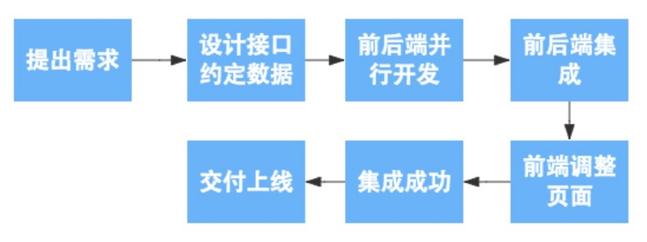

# 前后端分离实践

前后端分离大概可以从四个方面来理解：

## 互形式交

在前后端分离架构中，后端只需要负责按照约定的数据格式向前端提供可调用的API服务即可。前后端之间通过HTTP请求进行交互，前端获取到数据后，进行页面的组装和渲染，最终返回给浏览器。一般通过restful api

## 代码组织方式

## 开发模式

 在开发模式上，前后段分离不仅仅只是工程师的分工开发，更重要的意义在于`实现了前后端的并行开发，简化了开发流程`。

## 数据接口规范流程

 开发期间前后端共同商定好数据接口的交互形式和数据格式。然后实现前后端的并行开发，其中前端工程师再开发完成之后可以独自进行mock测试，而后端也可以使用接口测试平台进行接口自测，然后前后端一起进行功能联调并校验格式，最终进行自动化测试。

