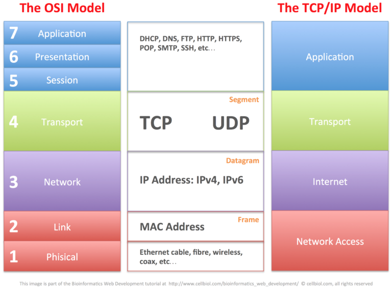
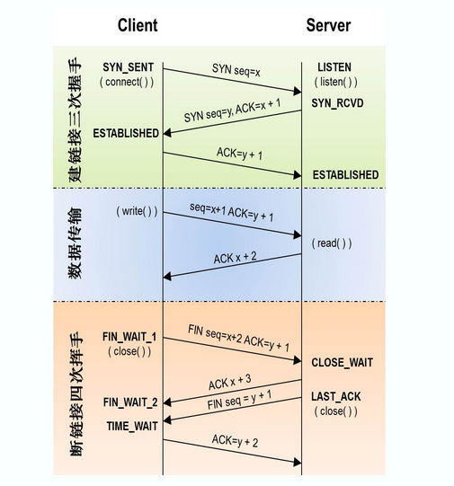

# TCP/IP

##  **什么是网络协议？**

 所谓网络协议，就是两台电脑要通讯就必须遵守共同的规则，就好比两个人要沟通就必须使用共同的语言一样。一个只懂英语的人，和一个只懂中文的人由于没有共同的语言（规则）就没办法沟通。两台电脑之间进行通讯所共同遵守的规则，就是网络协议。 

##  **TCP/IP协议和OSI模型有何区别**

 socket则是对TCP/IP协议的封装和应用\(application层面上\)。 Socket本身并不是协议，而是一个调用接口\(API\)

HTTP是应用层协议，主要解决如何包装数据。  

TPC/IP协议是传输层协议，主要解决数据如何在网络中传输

## **TCP和UDP的区别和联系？**

TCP传输比UDP传送更可靠, UDP传输效率更高

TCP 需要三次握手 UDP不需要

在不可靠的网络传送过程中一般选择TCP传送方式。在讲求效率，或者不在乎传送失误的情况下可以选择UDP方式来提高传输速率。 所以UDP的实时性更好。

程序员可以手动对UDP的数据收发进行验证，比如发送方对每个数据包进行编号然后由接收方进行验证啊什么的，

##  TCP连接的三次握手

