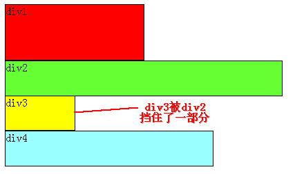

# CSS

## **页面导入样式时，使用link和@import有什么区别？**  

1. link属于XHTML标签，除了加载CSS外，还能用于定义RSS, 定义rel连接属性等作用；而@import是CSS提供的，只能用于加载CSS;
2. 页面被加载的时，link会同时被加载，而@import引用的CSS会等到页面被加载完再加载;


## **CSS box model 盒子模型**

\*\*\*\*


当设置高度宽度的时候只是设置了content的值

老版本的IE盒子 区别： IE的content部分把 border 和 padding计算了进去;  


## **CSS选择符有哪些？哪些属性可以继承？**

行内样式 **&gt;**  id选择器（ \# myid **&gt;** 类选择器（.myclassname）和伪类选择器\( :hover,:focus\) **&gt;** 标签选择器 伪元素\(:after :before\) 

|       **1.id选择器（ \# myid）                                               2.类选择器（.myclassname）       3.标签选择器（div, h1, p）       4.相邻选择器（h1 + p）       5.子选择器（ul &gt; li）       6.后代选择器（li a）       7.通配符选择器（ \* ）       8.属性选择器（a\[rel = "external"\]）       9.伪类选择器（a:hover, li:nth-child）    \*  可继承的样式： font-size font-family color, UL LI DL DD DT;    \*  不可继承的样式：border padding margin width height ;** |
| :--- |
|  |

## CSS 居中

```css
* 水平居中：给div设置一个宽度，然后添加margin:0 auto属性 
div{ 
    width:200px; 
    margin:0 auto; 
} 

* 让绝对定位的div居中 
div { 
    position: absolute; 
    width: 300px; 
    height: 300px; 
    margin: auto; 
    top: 0; 
    left: 0; 
    bottom: 0; 
    right: 0; 
} 

* 水平垂直居中一 确定容器的宽高 宽500 高 300 的层 设置层的外边距 
div { 
    position: relative; /* 相对定位或绝对定位均可 */ 
    width:500px; 
    height:300px; 
    top: 50%; 
    left: 50%; 
    margin: -150px 0 0 -250px; /* 外边距为自身宽高的一半 */ 
} 

* 水平垂直居中二 未知容器的宽高，利用 `transform` 属性 
div { 
    position: absolute; /* 相对定位或绝对定位均可 */ 
    width:500px; 
    height:300px; 
    top: 50%; 
    left: 50%; 
    transform: translate(-50%, -50%);
} 

* 水平垂直居中三 利用 flex 布局 实际使用时应考虑兼容性 
.container { 
    display: flex; 
    align-items: center; /* 垂直居中 */ 
    justify-content: center; /* 水平居中 */ 
} 
.container div { 
    width: 100px; 
    height: 100px; 
}

```

## 水平垂直居中

```css
// 方法一  
#container{
    position:relative;
}

#center{
    width:100px;
    height:100px;
    position:absolute;
    top:50%;
    left:50%;
    margin:-50px 0 0 -50px;
}

// 方法2 
#container{
    position:relative;
}

#center{
    position:absolute;
    margin:auto;
    top:0;
    bottom:0;
    left:0;
    right:0;
}
```


## **display有哪些值？说明他们的作用**

* block         块类型。默认宽度为父元素宽度，可设置宽高，换行显示。
* none          缺省值。象行内元素类型一样显示。
* inline        行内元素类型。默认宽度为内容宽度，不可设置宽高，同行显示。
* inline-block  默认宽度为内容宽度，可以设置宽高，同行显示。
* list-item     象块类型元素一样显示，并添加样式列表标记。
* table         此元素会作为块级表格来显示。
* inherit       规定应该从父元素继承 display 属性的值。

## **position的值relative和absolute定位原理**

* static
* relative
* fixed
* absolute
* sticky

Static:    默认值。没有定位，元素出现在正常的流中（忽略 top, bottom, left, right z-index 声明）

relative: 相对于其他的relative 元素， 可以设置top right bottom left 的属性来定位

fixed; 生成绝对定位的元素，相对于浏览器窗口进行定， 这样元素总是会显示再同一个位置无论屏幕怎么滚动。

absolute; 对于relative的父元素定位  


## CSS Units

* cm:  centimeters
* mm:  millimeters
* in: inches 
* px: pixels
* pt: point
* pv: picas
* em:  Relative to the font-size of the element \(2em means 2 times the size of the current font\)
* rem: Relative to font-size of the root element
* % Relative to the parent element


## **CSS3有哪些新特性？**

* 新增各种CSS选择器 （: not\(.input\)：所有 class 不是“input”的节点） 
* 圆角 （border-radius:8px） 
* 多列布局 （multi-column layout） 
* 阴影和反射 （Shadow\Reflect） 
* 文字特效 （text-shadow、） 
* 文字渲染 （Text-decoration） 
* 线性渐变 （gradient）
* 旋转 （transform）
*  缩放,定位,倾斜,动画,多背景 例如:transform:\scale\(0.85,0.90\) translate\(0px,-30px\) skew\(-9deg,0deg\)\Animation:

## **用纯CSS创建一个三角形的原理是什么？**

```css
arrow-up {
  width: 0; 
  height: 0; 
  border-left: 5px solid transparent;
  border-right: 5px solid transparent;
  border-bottom: 5px solid black;
}
```

## **为什么要初始化CSS样式**

因为浏览器的兼容问题，不同浏览器对有些标签的默认值是不同的，如果没对CSS初始化往往会出现浏览器之间的页面显示差异。  
****

## **CSS里的visibility属性有个collapse属性值是干嘛用的？**

对于普通元素visibility:collapse;会将元素完全隐藏,不占据页面布局空间,与display:none;表现相同.如果目标元素为table,visibility:collapse;将table隐藏,但是会占据页面布局空间.

## **CSS优化、提高性能的方法有哪些？**

* 内联首屏关键CSS（Critical CSS）将CSS直接内联到HTML文档中能使CSS更快速地下载。而使用外部CSS文件时，需要在HTML文档下载完成后才知道所要引用的CSS文件，然后才下载它们。所以说，内联CSS能够使浏览器开始页面渲染的时间提前，因为在HTML下载完成之后就能渲染了。 因为初始拥塞窗口3存在限制，所以不能都放在inline style
* 异步加载CSS, 使用JavaScript动态创建样式表link元素，并插入到DOM中。或者&lt;link rel="preload" href="mystyles.css" as="style" onload="this.rel='stylesheet'"&gt;
* 文件压缩 webpack
* 去除无用的CSS，优化css code
* 保持简单，不要使用嵌套过多过于复杂的选择器。
* 通配符和属性选择器效率最低，需要匹配的元素最多，尽量避免使用。
* 不要使用类选择器和ID选择器修饰元素标签，如h3\#markdown-content，这样多此一举，还会降低效率。
* 不要为了追求速度而放弃可读性与可维护性。

## **什么是CSS 预处理器 / 后处理器？**

  
预处理器例如：LESS、Sass、Stylus，用来预编译Sass或less，增强了css代码的复用性， 还有层级、mixin、变量、循环、函数等，具有很方便的UI组件模块化开发能力，极大的提高工作效率。

## float 以及 clear 

浮动可以理解为让某个div元素脱离标准流，漂浮在标准流之上，和标准流不是一个层次。




假如某个div元素A是浮动的，如果A元素上一个元素也是浮动的，那么A元素会跟随在上一个元素的后边\(如果一行放不下这两个元素，那么A元素会被挤到下一行\)；  
如果A元素上一个元素是标准流中的元素，那么A的相对垂直位置不会改变，也就是说A的顶部总是和上一个元素的底部对齐。

clear : none \| left \| right \| both

div1, div2 设置float left, 所以两个div 平行浮动，要想让div2下移，就必须在div2的CSS样式中使用浮动。clear:left  


## 圣杯布局和

 圣杯布局： **左右两栏固定宽度，中间部分自适应**

* **全部是float left， container width: 100%**
* \*\*\*\*

  

* **利用margin-left: -100%**  也就是left往左移main的整个宽度
* 利用margin-left: -190px 也就是right往左移main的右侧

  

* 需要给con容器加padding值
* 设置left right div 的left right值，可以定义元素的左右边缘，注意要给元素定位，relative or absolute

  

## 双飞翼布局

当圣杯布局已经形成同行排列，只不过main值被覆盖了，圣杯布局的第三步是给con容器添加padding属性，而双飞翼布局是为main里面的内容再加一个div，让main的内容包含在内层div里。

## CSS等高布局

table: 设置display: table-cell 就等高的

absolute:  设置子元素的top:0;bottom:0;使得所有子元素的高度都和父元素的高度相同，实现等高效果

```css
<style>
body,p{margin: 0;}
.parent{
    position: relative;
    height: 40px;
}
.left,.center,.right{
    position: absolute;
    top: 0;
    bottom: 0;
}
.left{
    left: 0;
    width: 100px;
}
.center{
    left: 120px;
    right: 120px;
}
.right{
    width: 100px;
    right: 0;
}
</style>

```

```markup
<div class="parent" style="background-color: lightgrey;">
    <div class="left" style="background-color: lightblue;">
        <p>left</p>
    </div>  
    <div class="center" style="background-color: pink;">
        <p>center</p>
        <p>center</p>
    </div>          
    <div class="right" style="background-color: lightgreen;">
        <p>right</p>
    </div>        
</div>
```

Grid: 

```text
.parent{
    display: grid;
    grid-auto-flow: column;
    grid-gap:20px;
}
```

## One Weird 🙊 Trick To Debug CSS {#9703}

